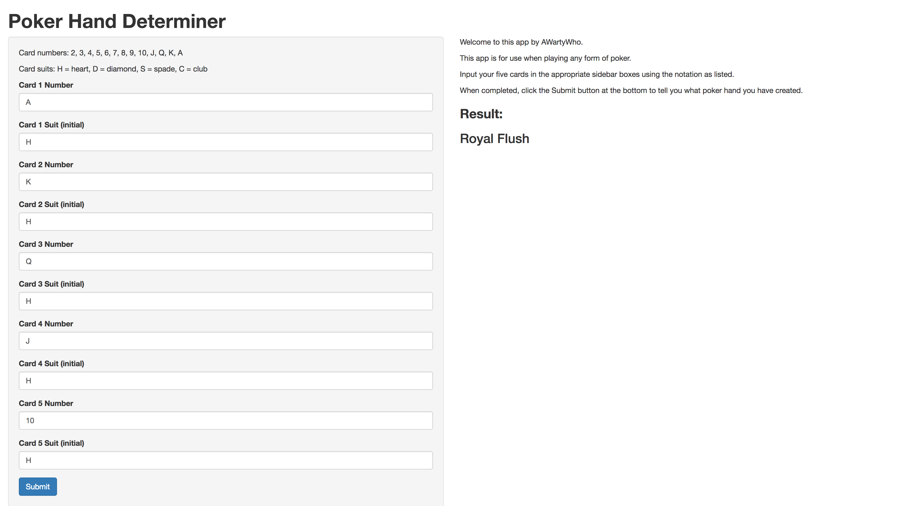

## Background

This presentation is part of the *Developing Data Products* course in the Data Science Specialization.

The GitHub repository containing the app and presentation code can be found here: https://github.com/AWartyWho/Poker-Hand-Determiner

The relevant Shiny app can be found at this link: https://awartywho.shinyapps.io/Poker-Hand-Determiner/

## Description

For this assignment, I have created a Shiny application and deployed it on Rstudio's shinyapps.io servers. I have built a Poker Hand Determiner (apologies - I felt like doing something fun/different still within the assignment criteria).

A user can input their current 5-card poker hand (card number & suit).

When the submit button is clicked, the app determines what poker hand they have, from High Card to Royal Flush.

## Sample

```{r, echo=FALSE, out.width = "700px"}

```

## Example

Here, I have (in the background) created a function, **poker**, that evaluates the equivalent of the app from the same 10 arguments.

Two examples of outputs can be found below:

```{r, echo=FALSE}
poker <- function(n1, s1, n2, s2, n3, s3, n4, s4, n5, s5) {
  
  multisub <- function(p, replace, x, ...) {
    result <- x
    for (i in 1:length(p)) {
      result <- gsub(p[i], replace[i], result, ...)
    }
    as.numeric(result)
  }
  
  n1 <- multisub(c("J", "Q", "K", "A"), c(11, 12, 13, 14), n1)
  n2 <- multisub(c("J", "Q", "K", "A"), c(11, 12, 13, 14), n2)
  n3 <- multisub(c("J", "Q", "K", "A"), c(11, 12, 13, 14), n3)
  n4 <- multisub(c("J", "Q", "K", "A"), c(11, 12, 13, 14), n4)
  n5 <- multisub(c("J", "Q", "K", "A"), c(11, 12, 13, 14), n5)
  
  number <- c(n1, n2, n3, n4, n5)
  suit <- c(s1, s2, s3, s4, s5)
  comb <- c(paste(number[1],suit[1]),
            paste(number[2],suit[2]),
            paste(number[3],suit[3]),
            paste(number[4],suit[4]),
            paste(number[5],suit[5]))
  
  if (any(!number %in% 2:14)) {
    
    stop("Invalid card number(s) present")
    
  } else if (any(!suit %in% c("H", "D", "S", "C"))) {
    
    stop("Invalid card suit(s) present")
    
  } else if (length(unique(comb)) < 5) {
    
    stop("Duplicate cards present")
    
  }
  
  if (all(suit == suit[1])) {
    
    if (all(sort(number) == c(10, 11, 12, 13, 14))) {
      
      "Royal Flush"
      
    } else if (all(diff(as.numeric(sort(number))) == 1) | all(sort(number) == c(2, 3, 4, 5, 14))) {
      
      "Straight Flush"
      
    } else {
      
      "Flush"
      
    }
    
  } else {
    
    agg <- aggregate(data.frame(count = number), list(value = number), length)
    
    if (nrow(agg) == 2) {
      
      if (abs(agg[1,2] - agg[2,2]) == 3) {
        
        "Four of a Kind"
        
      } else {
        
        "Full House"
        
      }
      
    } else if (nrow(agg) == 3) {
      
      if (median(agg[,2]) == 1) {
        
        "Three of a Kind"
        
      } else {
        
        "Two Pair"
        
      }
      
    } else if (nrow(agg) == 4) {
      
      "Pair"
      
    } else {
      
      if (all(diff(as.numeric(sort(number))) == 1) | all(sort(number) == c(2, 3, 4, 5, 14))) {
        
        "Straight"
        
      } else {
        
        "High Card"
        
      }
    }
  
  }
}
```

```{r}
poker(10, "H", "J", "H", "Q", "H", "K", "H", "A", "H")
poker(10, "D", "Q", "H", 9, "S", "J", "S", 8, "C")
```